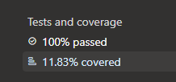
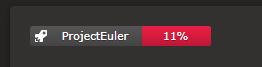
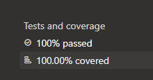
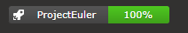

# azure-code-coverage
WebApi to provide code-coverage data for azure devops builds.

# Inspiration
I looked for a way to display my code coverage in a widget but I didn't want my code or results sent to some endpoint in the world, so I decided to create my own Api to create me my own badges. The Dotnet7 app can be hostet by yourself so your data is safe as well. Just provide the app with an PAT from azure and you are good to go.

*Uses Azure DevOps Services REST API 7.2

# Usage
You can host your own status badge creator for code coverage

Use it in your README or as an widget in Azure

```markdown
[](https://dev.azure.com/{organization}/{project}/_build/latest?definitionId={pipelineId}&branchName={branchName})
```

### Parameter

- `branchName` (default is main)
- `decimalPlaces` (default is 0)
- `displayName` (definitionName when empty)
- `errorThreshhold` (default is 30)
- `warningThreshhold` (default is 70)

A Bad requests gets returned based on the following rules

- `decimalPlaces` is greater than 0
- `errorThreshhold` is greater than zero and less or equal to 100
- `warningThreshhold` is greater than zero and less or equal to 100
- `warningThreshhold` is greater than `errorThreshhold`

If the `decimalPlaces` is greater than zero the percentage is rounded down because I don't want the badge to say 100% when in reality it only is 99.99% or something. Maybe in big projects this could lead to confusion. If the `decimalPlaces` is zero the percentage is rounded to even.

- 100% will always be displayed without decimal places.
- 0.0001 with `decimalPlaces=2` will be shown as 0%

If you provide `decimalPlaces=0`, `errorThreshhold=30` and `warningThreshhold=70` the badge will show 

- green from 100% - 70%
- yellow from 69% - 30%
- red from 29% - 0%

### Bad coverage

 

### Good coverage

 

# Deployment
I use a docker-compose file like this

```yaml
version: "3.4"

services:
    api:
        image: jjs98/azure-code-coverage
        environment:
          Settings:AzureToken: {azureToken}
        ports:
          - 80:80
```

# References
Azure DevOps Services REST API 7.2

[Build - Latest - Get](https://learn.microsoft.com/en-us/rest/api/azure/devops/build/latest/get?view=azure-devops-rest-7.2)

[TestResults - Codecoverage - Get](https://learn.microsoft.com/en-us/rest/api/azure/devops/testresults/codecoverage/get?view=azure-devops-rest-7.2)